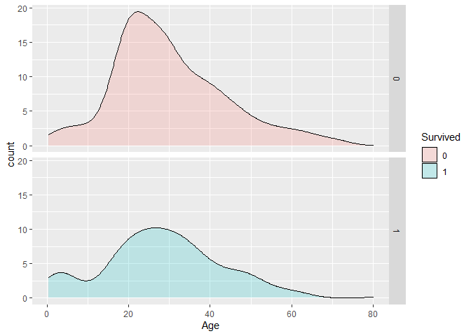
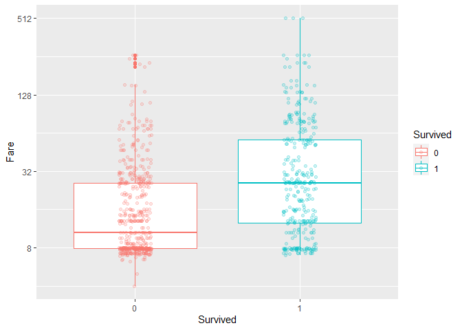
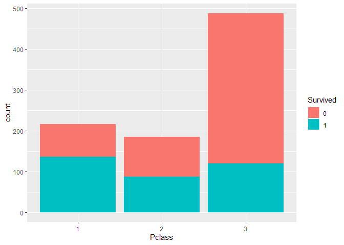
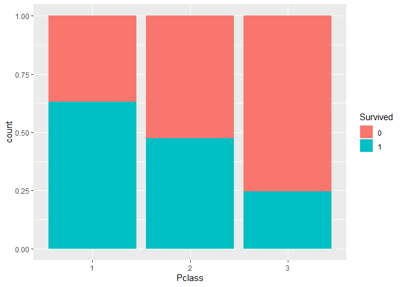
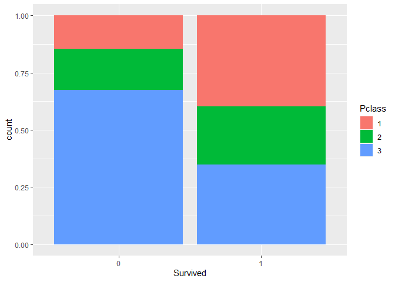
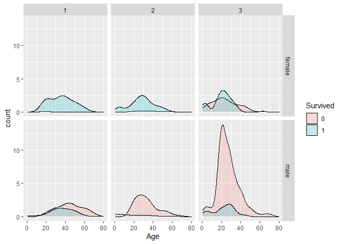

Titanic-Study-Report
================
Madhumita Mukherjee
15/02/2021

## Introduction

This is a report on 15 April 1912, the unsinkable Titanic ship sank and
killed 1502 passengers out of 2224.The original data obtained from
(<https://web.stanford.edu/class/archive/cs/cs109/cs109.1166/stuff/titanic.csv>).

We are going to use the following libraries:

``` r
library(tidyverse)
library(dplyr)
library(dslabs)
```

and load the data we already wrangled:

``` r
load("rda/Titanic.rda")
```

### Density plot of Age grouped by Sex

We note that male and female has the same general shape of age
distribution. The age distribution was bi-modal, with one mode around 25
years of age and a second smaller mode around 5 years of age.


### QQ-Plot of passenger’s age

The QQ-plot of passenger’s age has been done with an identity line using
*geom\_abline()*. The Filtering operation has been performed for the
unspecified data of the passenger’s age.


### Bar-plot of passenger’s Survived proportion Vs Sex ratio in Titanic

The Bar plot of passenger’s Survived Vs Sex ratio has been demonstrated
in the graph. The graph revels that most of the females are survived and
less than half of the passengers are survived.


### Density plot of Age grouped by Survival status

The density plot of Age grouped by survival status has been done. This
density plot revels that age group between 18-30 has the most death.



### Box plot of Fare vs Survival status

The Box plot of Fare vs Survival status has been done. This plot reveals
that passengers who survived generally pay higher fare. The median fare
was lower for passengers who did not survive.



### Bar plot of Survival by Passenger Class

-   The bar plot of passenger class filled by survival has been done
    here. The first bar plot of passenger class count filled by survival
    shows most passengers in first class survived and most passengers in
    other classes did not survive.



-   The second bar plot of passenger class proportions filled by
    survival shows survival proportion was highest for first class
    passengers, followed by second class. Third-class had the lowest
    survival proportion.



-   The third bar plot of survival filled by passenger class proportions
    shows that majority of those who did not survive were from third
    class.



### Density plot of Age Vs Passenger Class

Density plots for age, filled by survival status, with count on the
y-axis, faceted by sex and passenger class has been shown here. The plot
provide the information about that largest group of passengers was
third-class males. Most first-class and second-class females survived
and almost all second-class males did not survive, with the exception of
children.


