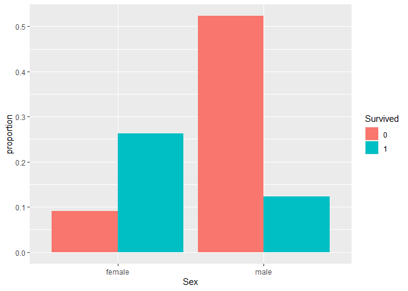

Titanic-Study-Report
================
Madhumita Mukherjee
15/02/2021

## Introduction

This is a report on 15 April 1912, the unsinkable Titanic ship sank and
killed 1502 passengers out of 2224.The original data obtained from
(<https://web.stanford.edu/class/archive/cs/cs109/cs109.1166/stuff/titanic.csv>).

We are going to use the following libraries:

``` r
library(tidyverse)
library(dplyr)
library(dslabs)
```

and load the data we already wrangled:

``` r
load("rda/Titanic.rda")
```

### Density plot of Age grouped by Sex

We note that male and female has the same general shape of age
distribution. The age distribution was bi-modal, with one mode around 25
years of age and a second smaller mode around 5 years of age.

<!-- -->

### QQ-Plot of passenger’s age

The QQ-plot of passenger’s age has been done with an identity line using
*geom\_abline()*. The Filtering operation has been performed for the
unspecified data of the passenger’s age.

<!-- -->

### Bar-plot of passenger’s Survived proportion Vs Sex in Titanic

The Bar plot of passenger’s Survived Vs Sex ratio has been demonstrated
in the graph. The graph revels that most of the females are survived and
less than half of the passengers are survived.

<!-- -->
