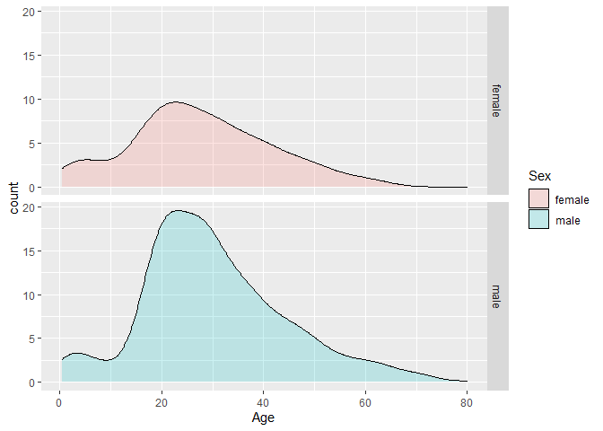

Titanic-Study-Report
================
Madhumita Mukherjee
15/02/2021

## Introduction

This is a report on 15 April 1912, the unsinkable Titanic ship sank and
killed 1502 passengers out of 2224.The original data obtained from
(<https://web.stanford.edu/class/archive/cs/cs109/cs109.1166/stuff/titanic.csv>).

We are going to use the following libraries:

``` r
library(tidyverse)
library(dplyr)
library(dslabs)
```

and load the data we already wrangled:

``` r
load("rda/Titanic.rda")
```

## Density plot of Age grouped by Sex

We note that male and female has the same general shape of age
distribution and the age distribution was bi-modal, with one mode around
25 years of age and a second smaller mode around 5 years of age.

<!-- -->
